MILESTONE PROJECT ONE - USER CENTRIC FRONTEND DEVELOPMENT 
# Gym|mies A gym for the stay-at-home mums
This project features a website of a gym that caters towards stay-at-home mothers. 
The website is designed to be simple to use, easy on the eyes and sufficiently informative at first glance.
The user will be able to scroll through a image carousel, request a schedule to be sent via email through a modal pop-up form
and asked to be contacted through a contact form. 

## This project can be viewed here : [Gym|mies](https://finnsterfran.github.io/Gymmies-Milestone-1-Project---Frannie-Yip/index.html)

# UX
## User stories
### Visitor to the website 
* I want to have a visual idea of what to expect at this gym, so images would be nice. 
* I don't want too much text to scroll through to read, as a busy mother I don't have all day to read.
* I want to be able to easily access information that I need with as little clicking as possible.
* I want to know what kind of services to expect, and what kind of packages and prices there are.
* I want to be able contact someone for information. 

### Business developer for website 
* I want to give users a visually comfortable experience on the website, calm colours and simple layout.
* I want users to be able to find the information they need quickly, so easy navigation is important.
* I want to simplify the pricing choices the user will have to make when choosing to sign up.
* I want users to return to the website regularly.

## 1. Strategy 
* The target users to this website are stay-at-home mothers, it has to be simple and not time consuming to navigate.
* This website needs to appeal to them visually, psychologically and emotionally.
* The homepage should already provide, at first glance, all the vital information about the business. It should answer questions like:
    * Does this have all the services I need? 
    * What are the opening times?
    * Where is it located?
    * Where can I find further information?
    * Are there any upcoming events? (provided in carousel)
* Provide one feature that would require the user to return to the website on a regular basis.

## 2. Scope 
* A carousel slide and multiple images to provide visual representation of the business that the website features.
* Easy to navigate within the website.
* A visual outline of the services provided on the landing page.
* Provide a reason to return to the website - requesting updated schedule. 
* Allow the user to request for contact and choose the method of how they wish to be contacted.

## 3. Structure 
* The consistent features throughout all pages on the websites are:
    * Logo at the top 
    * Website navigation bar just under the Logo
    * Social navigation icons at the footer
* The homepage provides an impression, the images in the carousel and the boxes with icons of the services provided will give the users a good idea of what to expect.
* The about page will provide simple information outlining what the business is about, what kind of package is offered and the kind of pricing that is available.

## 4. Skeleton 
* Logo - Clickable link that brings user back to homepage.
* Navigation bar :
    * Home - returns user to homepage 
    * About - information about the business, package details and pricing
    * Services - alert with button that opens up a modal form for users to fill in name and email address. Images and descriptive text about the different services available.
    * Contact - A form for users to fill in to request for communication.
* Footer :
    * Facebook icon - clickable link that brings user to Facebook.
    * Twitter icon - clickable link that brings user to Twitter.
    * Instagram icon - clickable link that brings user to Instagram.
    * Linkedin icon - clickable link to bring use to Linkedin. 
  
* Wireframes :

### Wireframes - Desktop

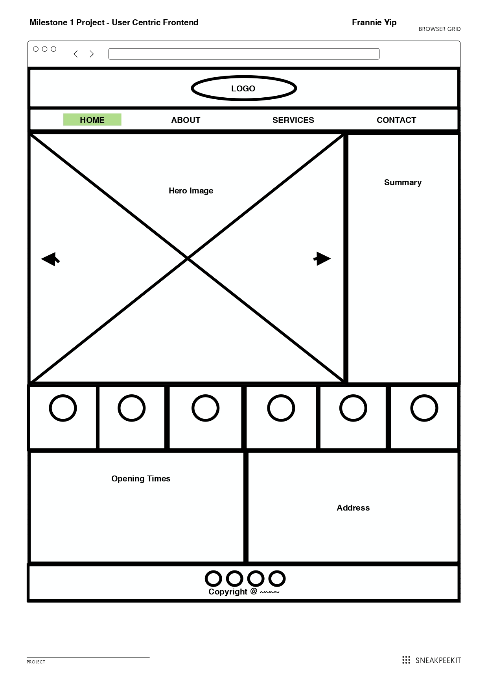

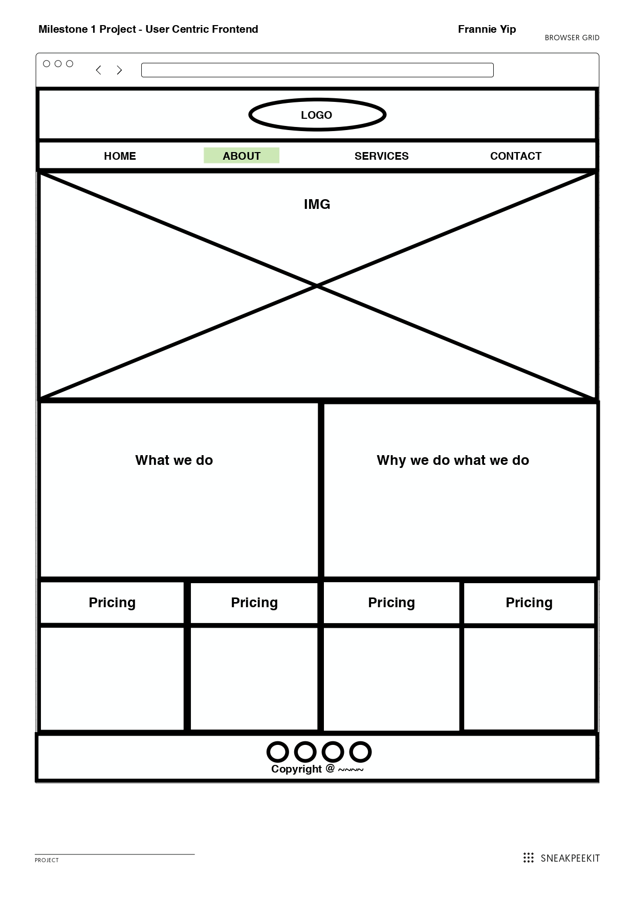

#### Note : I added an alert bar just below the navigation bar with a button that opens up a modal form for user to request for a schedule to be emailed.
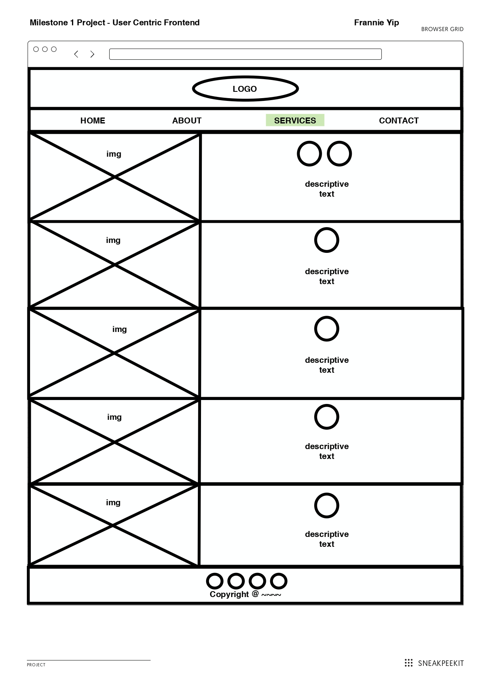

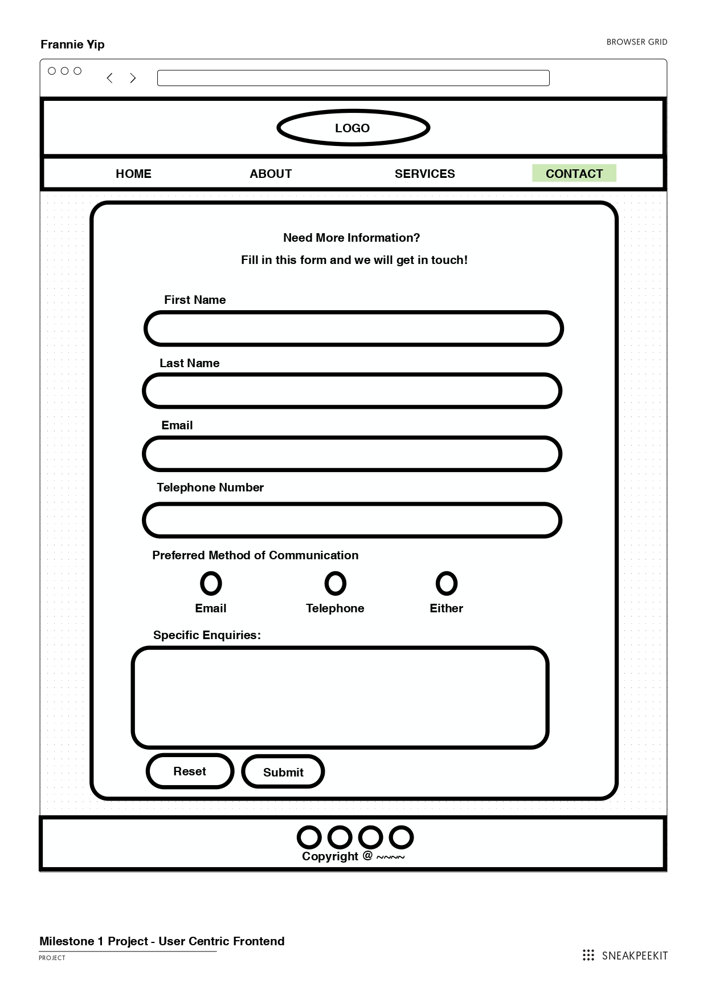

### Wireframes - Tablet (max-width: 748px)

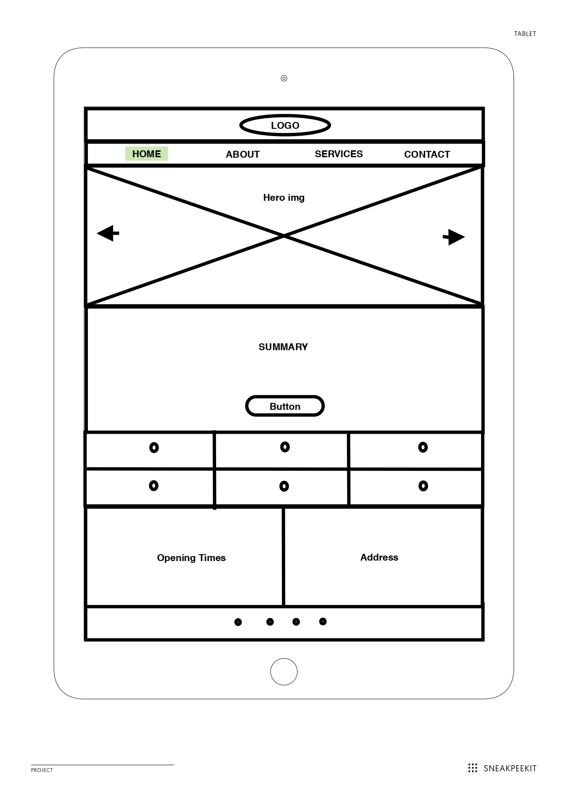

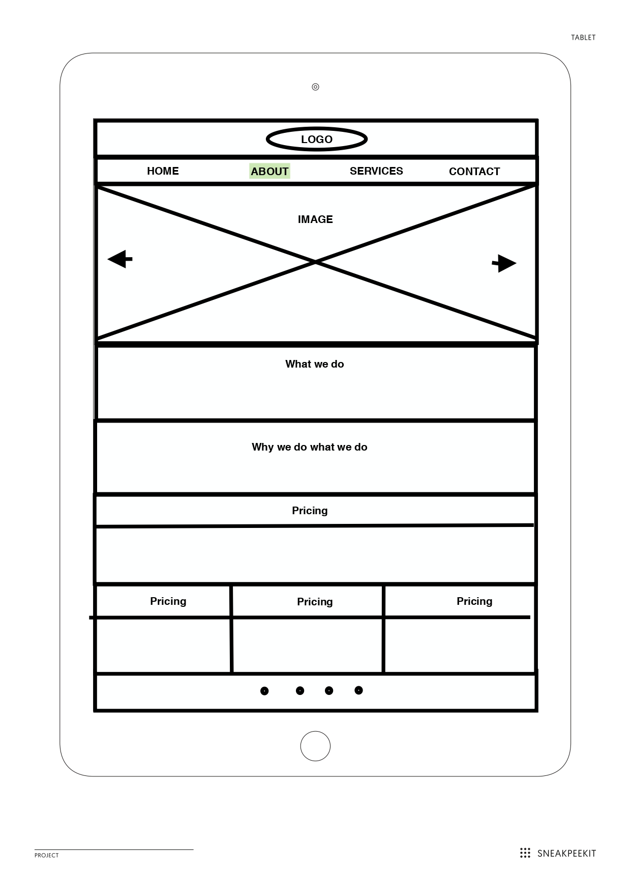

#### Note : I added an alert bar just below the navigation bar with a button that opens up a modal form for user to request for a schedule to be emailed.
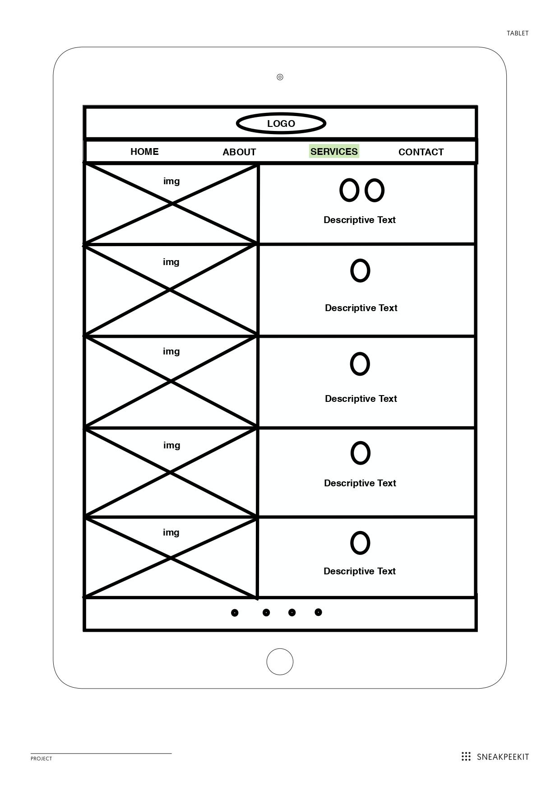

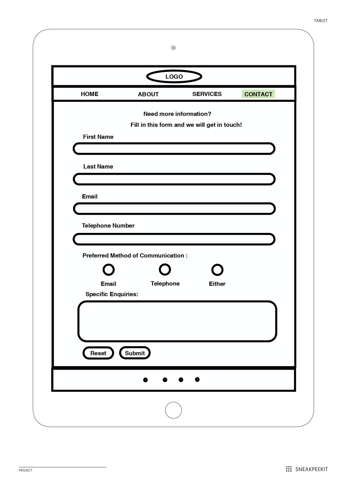

### Wireframes - Mobile (max-width: 520px)
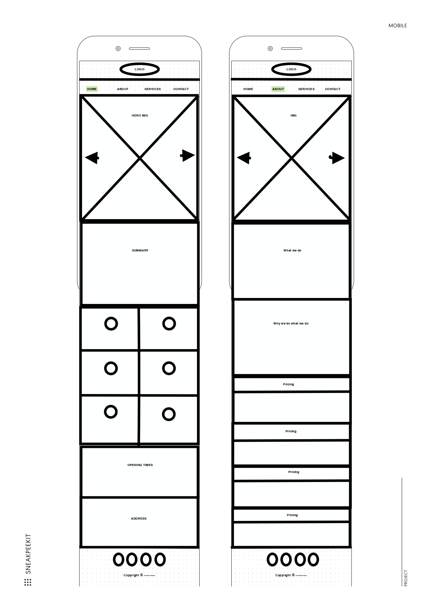

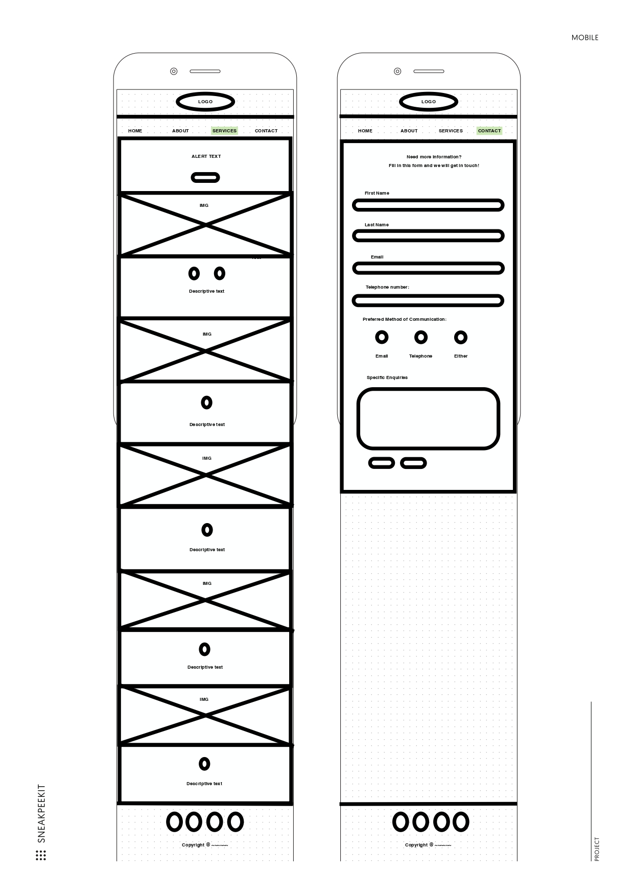

## 5. Surface 
### Colors :
The color palette I choose comes from [Colorhunt](https://colorhunt.co/) 
I choose this color palette for its naturally and calming feel, and it doesn't distract from the content of the website.

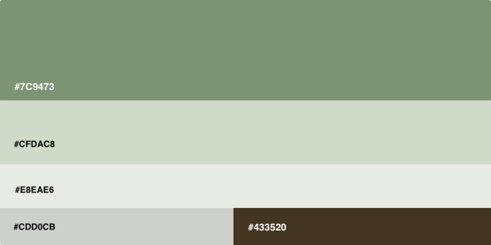

### Typography :
"Pacifico" font family used mainly for the logo but also appears twice in About for content titles.
"Roboto" font family is primary for the entire body of the website.

# Features 
## Existing Features 
* Responsive navigation bar 
* Carousel slider for images
* Read More button navigates to the about page 
* Alert bar button opens up a modal form for inputting name and email for submission to request yoga/pilates class schedules to be emailed to user
* Submittable form in contact page 

## Features to consider implementing in the future 
* A shout-out for upcoming events on homepage
* A map to show where the location of the gym
* A login for users to sign up for classes online

# Technologies Used 
## Languages
* HTML5
* CSS3 
* Bootstrap 4.5

## Integrations 
* [Google Fonts](https://fonts.google.com/) - Typography
* [Font Awesome](https://fontawesome.com/) - Icons 
* [Bootstrap](https://getbootstrap.com/) - Framework

## Workspace, Version Control and Repository Storage 
* [Gitpod](https://gitpod.io/) 
* [Github](https://github.com/)
* [Git](https://git-scm.com/)

# Resources 
* [Bootstrap Docs](https://getbootstrap.com/)
    * for carousel, alert & modal 
* [Github Guides](https://guides.github.com/features/mastering-markdown/)
    * for Markdown language reference
* [Sneakpeekit](https://sneakpeekit.com/)
    * printable grids which I used for my wireframes and edited using preview
* [Unsplash](https://unsplash.com/)
    * all the images that I have used on this project 
* [W3Schools](https://www.w3schools.com/)
    * one of the sources for 'how-to'
* [Stackoverflow](https://stackoverflow.com/) 
    * one of the sources for 'how-to'
    
# Testing
1. I ran the individual HTML pages through [W3 Validator](https://validator.w3.org/) 

#### Home-page -  2 errors.
* a element cannot be direct child of button  
    * I fixed this by removing the button element altogether and just inserting the pre-defined class of "mainbutton"
        * < a  >href="about.html" class="mainbutton">Read More < /a >
* thead is within table body 
    * I fixed this by adding in the missing elements < tr > below < thead > and changing < td >
to < th > instead.
#### About-page - multiple warnings
* error/warning for 'bogus comments', I had added one hyphen too many to the end of the comments.
    * fixed this by removing all the extra hyphen

#### Services-page 
* only returned one error/warning, again 'bogus comment'.

#### Contact-page 
* returned one error to the form element, action was empty.
    * fixed issue by adding a "#' to action.

2. I ran the codes in [Closing Tag Checker](https://www.aliciaramirez.com/closing-tags-checker/) 
* All results = No unclosed tags.

3. I ran style.css in [W3C Css Validator](https://jigsaw.w3.org/css-validator/validator)
* It returned with no errors.

# Deployment
* I used Gitpod, which is the online IDE recommended by Code Institute.
* I used the [Code Institute Template](https://github.com/Code-Institute-Org/gitpod-full-template) to start on this project.
* After adding, commiting and pushing my codes to Github repository where my work is stored, I took the following steps to for deployment:
    * Clicked my project repository
    * Under 'Settings', I scrolled down to the section with 'Github Pages'.
    * For 'Source', I clicked 'main' in the dropdown selection and saved.
    * My website was now live, and has it's own URL. 
    * Cloning this is possible by clicking on the Code button.
        * This opens the options of URL to the project, to open with Github Desktop or download a zip copy of the project.

# Version Control 
#### Commit 1 - Initial Commit 
Created the foundation of the website: 
* asset folder containing css and images sub-folders
* index.html, about.html, services.html, contact.html, style.css.
* header, navigation bar and footer html & CSS template created and applied to each .html page.  

#### Commit 2 - Added to hero section, features and information sessions
* implemented a carousel to showcase 6 photographs, with user control scrolling.
* added the summary session to the right of the carousel. 
* added the features section which consist of 6 boxes sitting side by side horizontally.
* added opening times and information section.

#### Commit 3 - Added a modal to service.html, images and text boxes.
* worked on including an alert bar with a button that opens a modal form in service.html
* added images and text boxes. 
* added css styling for services.html

#### Commit 4 - Added form to contact.html
* added form using bootstrap form
* adde css styling for form
* made minor changes to hero section in index.html

#### Commit 5 - Completed about.html.
* added main image for page
* double boxes for about information
* bootstrap cards for the pricing boxes
* added css styling for page

#### Commit 6 - Restructured contact.html added media query (max-width: 1024px)
* contact.html was not lining up properly, I redid the container without bootstrap so that it would line up properly,
* begin on media query for laptop viewport

#### Commit 7 - Finished all other viewport mediaquery
* meqia queries for the other viewports

#### Commit 8 embedded img index.html and about.html for accessibility, fixed social links
* removed the hero images from style.css and embedded them directly into index.html
* added alt text to the images for accessibility
* fixed social media links at footer. Linked were not full url address so they did not link properly.

#### Commit 9
* fixed path to include . in front because the images would not load on webpage

#### Commit 9 fixed images and boxes in services.html
* removed images from style.css for services.html and embedded them directly in html for accessibility.
* changed the layout of the boxes and image. 

#### Commit 10, 11, 12, 13 Changes to css.html for Responsiveness
* made some adjustments to media query 
* added container for contact form because it was not resizing properly in mobile viewport

#### Commit 14 minor change to contact.html screenshots added to readme.md
* fixed some sizing issues with contact.html's form
* added screenshots to readme.md

#### Commit 15 more screenshots, documention, fixed testing errors
* added more screenshots
* added documentation to readme.md
* fixed testing errors

#### Commit 16 fixed arrow in input box contact.html
* added a code to remove the arrows

#### Commit 17 final fixes 
* made slight tweaking to the final version of the project, updated README.md

#### Commit 18 minor changes to image size and meta tag
* fixed image sizing and meta tag

# Problems I've encountered
* getting the boxes to align properly when moving from one viewport to another, this took quite a bit of time to fixed
* in services.html, I had initially started with an image and text box per row and alternate to text image. When apply responsive resizing, the boxes would be stacked on top of each other, at some points text box on top of text box. I tried to do a flex-direction: reverse-column, but this made some of the text disappear under the images. So I opted for a change in layout.
* I had the most trouble with the form in contact.html. I wanted it simple and something that would let me apply what I learned in html5. Adjustmets for the responsiveness took a lot of tries and figuring out. 
* Button error - I had to make the 'Read More' button functional without having an anchor element as a child to the button element. Took a bit of searching online to find out how to do that.
* I noticed that in the input box for telephone number in the form on contact.html, an pair of up and down arrows appeared towards the right end of the box.
    * changed type to "tel"

# Codes 
* I lifted out and made use of the standard codes in bootstrap for the carousel, modal and cards.

# Credit
* Thanks to my mentor Excellence Ilesanmi for his patient guidance and letting me pick his brain for ideas.
* Thanks to [Henrique Peperoni](https://github.com/Henriqueperoni) whose meticulously written Readme document was the format I based my own Readme document on.
* Thanks to the Code Institute's Slack Community for helping me with a github filepath issue.

